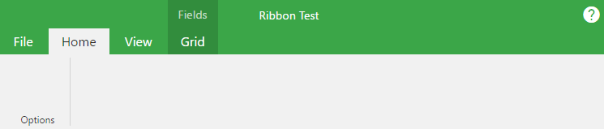

# ribbon-toolbar

## CSS properties
* `--dark-background`: Used as the colored background for the ribbon.
  Defaults to `var(--brand-primary)`.
* `--light-background`: Used as the light background of the sections and the
  selected tab. Defaults to `#f1f1f1`

## Ribbon.default
Should wrap the ribbon components used.
`Ribbon.ApplicationMenu` and `Ribbon.Tabs` are required direct descendants,
and `Ribbon.ContextualTabs` and/or `Ribbon.Header` are optional
direct descendants. Other children will be ignored.

The `id` prop can be used to set the ID of the ribbon's form element.
It defaults to `"ribbon"`.

## Ribbon.Header
Header container for the ribbon. Doesn't have any special JS logic,
just some CSS styles. Any props given will be set on the `header` HTML element.

## Ribbon.Title
Wrapper for the title in the Ribbon Header

## Ribbon.HelpSection
Section for a help icon.
* TODO: Modify the help section to be more generic

## Ribbon.ApplicationMenu
Displayed as the first tab on the toolbar, and opens a pop-up menu.

## Ribbon.Tabs
Wrapper for the core tab elements.

## Ribbon.ContextualTabs
Wrapper for the tab group elements.

## Ribbon.Tab
| Prop | Description |
| ---- | ----------- |
| children | Visible when the tab is selected, contains the body of the tab's section. |
| title | The text displayed on the small tab icon. Can be any react node. |
| altKey | Used as the key for react. In the future, this will have functionality similar to `accesskey`. |

## Ribbon.TabGroup
| Prop | Description |
| ---- | ----------- |
| children | Should be Tab elements |
| title | The text displayed above the group's small tabs. |

## Ribbon.MenuGroup
Used to section off sub-menus inside a single tabbed menu section.
| Prop | Description |
| ---- | ----------- |
| children | Any React node |
| title | String displayed underneath the child elements |